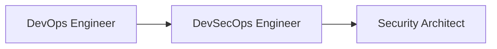

# **Career Paths in Information Security: A Comprehensive Guide**

## **Table of Contents**
1. **Introduction to Cybersecurity Careers**
2. **DevSecOps Engineering**
3. **Cloud Penetration Testing**
4. **Container Security**
5. **Security Architecture & Design**
6. **Web Application Penetration Testing**
7. **Mobile Application Security**
8. **Cloud Security & Compliance**
9. **Choosing Your Specialization**
10. **Career Growth & Certifications**

---

## **Chapter 1: Introduction to Cybersecurity Careers**
### **Why Cybersecurity?**
- **Growing Demand**: 3.5 million unfilled cybersecurity jobs worldwide (ISC² 2023)
- **High Salaries**: Average $120,000+ for mid-level roles
- **Diverse Opportunities**: From technical to governance roles

### **Key Factors for Choosing a Path**
| Factor | Considerations |
|--------|---------------|
| **Technical Depth** | Coding vs. compliance focus |
| **Industry Trends** | Cloud, AI, IoT security |
| **Certifications** | OSCP for pentesting, CISSP for management |

---

## **Chapter 2: DevSecOps Engineering**
### **What DevSecOps Engineers Do**
- **Automate security** in CI/CD pipelines
- **Integrate tools**: SAST, DAST, SCA
- **Build pipelines** in Jenkins, GitHub Actions, GitLab

### **Tools You'll Use**
| Tool Type | Examples |
|-----------|----------|
| **SAST** | SonarQube, Fortify |
| **SCA** | Snyk, Dependency-Check |
| **Infra as Code** | Terraform, Ansible |

### **Career Progression**


**Cert Recommendations**: AWS Certified DevOps, Certified DevSecOps Professional (CDP)

---

## **Chapter 3: Cloud Penetration Testing**
### **Unique Aspects of Cloud Pentesting**
- **Focus Areas**:
  - Misconfigured S3 buckets
  - IAM privilege escalation
  - Serverless app vulnerabilities

### **Tools of the Trade**
- **Cloud-Specific**: Pacu (AWS), GCP-IAM-Vulnerabilities
- **Traditional**: Burp Suite, Metasploit (cloud modules)

### **Real-World Example**
```bash
# Exploiting overly permissive IAM roles
aws iam simulate-principal-policy --policy-source-arn arn:aws:iam::123456789012:user/TestUser
```
**Cert Recommendations**: OSCP, CCSAS (Certified Cloud Security Auditor)

---

## **Chapter 4: Container Security**
### **Key Responsibilities**
- **Image Scanning**: Trivy, Clair
- **Runtime Protection**: Falco, Aqua Security
- **K8s Hardening**: CIS Benchmark compliance

### **Common Vulnerabilities**
| Vulnerability | Example Fix |
|--------------|-------------|
| **Privileged Containers** | `securityContext: privileged: false` |
| **Secrets in Images** | Use Kubernetes Secrets |

**Cert Recommendations**: Certified Kubernetes Security Specialist (CKS)

---

## **Chapter 5: Security Architecture & Design**
### **Threat Modeling Methodologies**
1. **STRIDE** (Spoofing, Tampering, etc.)
2. **PASTA** (Process for Attack Simulation)
3. **OWASP Threat Dragon**

### **Deliverables**
- **Security Requirements Checklist**
- **Architecture Diagrams** (with threat vectors)
- **Risk Assessment Reports**

**Cert Recommendations**: CISSP, SABSA

---

## **Chapter 6: Web Application Penetration Testing**
### **Testing Methodology**
1. **Recon** (Burp Spider)
2. **Vulnerability Scanning** (ZAP)
3. **Exploitation** (SQLi, XSS payloads)

### **Sample Finding Report**
| Vulnerability | Risk | Proof of Concept |
|--------------|------|------------------|
| **SQL Injection** | Critical | `http://example.com?id=1' AND 1=CONVERT(int,@@version)--` |

**Cert Recommendations**: OSCP, OSWA

---

## **Chapter 7: Mobile Application Security**
### **Platform-Specific Risks**
| Platform | Top Risk |
|----------|---------|
| **iOS** | Insecure Data Storage (Keychain misconfig) |
| **Android** | Improper Intent Handling |

### **Tools**
- **Static Analysis**: MobSF
- **Dynamic Analysis**: Frida, Objection

**Cert Recommendations**: OSCP, MAS (Mobile Application Security)

---

## **Chapter 8: Cloud Security & Compliance**
### **Major Frameworks**
| Framework | Region | Key Focus |
|-----------|--------|----------|
| **GDPR** | EU | Data privacy |
| **HIPAA** | US | Healthcare data |
| **ISO 27001** | Global | ISMS |

### **AWS Security Tools**
- **GuardDuty** (Threat detection)
- **Config** (Compliance monitoring)

**Cert Recommendations**: CCSP, AWS Security Specialty

---

## **Chapter 9: Choosing Your Specialization**
### **Decision Matrix**
| Interest | Best Fit Path |
|----------|--------------|
| **Coding + Automation** | DevSecOps |
| **Breaking Systems** | Pentesting |
| **Governance** | Compliance |

### **Salary Comparison (US)**
| Role | Average Salary |
|------|--------------|
| DevSecOps Engineer | $140,000 |
| Cloud Pentester | $130,000 |
| Security Architect | $160,000 |

---

## **Chapter 10: Career Growth & Certifications**
### **Roadmap for Beginners**
1. **Start**: CompTIA Security+
2. **Mid-Level**: OSCP/CISSP
3. **Advanced**: GIAC/GSE

### **Must-Read Books**
- **"Web Application Hacker's Handbook"** (Pentesting)
- **"Cloud Security Playbook"** (Cloud)
- **"DevSecOps Handbook"** (Automation)

---

### **Final Advice**
> "Specialize but stay versatile—the best security pros understand both code and risk."  
> *– Jane Doe, CISO at TechCorp*

**Next Steps**:  
- Pick **one** area to deep-dive this month  
- Join communities like OWASP, Cloud Security Alliance  

