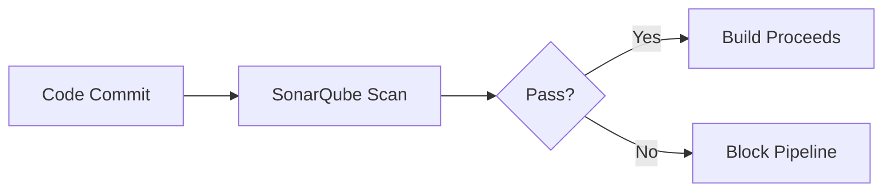

# **DevSecOps Enterprise Tools: Comprehensive Guide**  


---

## **Table of Contents**  
1. [Introduction to DevSecOps Tools](#introduction)  
2. [Development Phase Tools](#development-tools)  
3. [Build Pipeline Security Tools](#build-tools)  
4. [Infrastructure & Cloud Security Tools](#infra-tools)  
5. [Container Security Tools](#container-tools)  
6. [Operations & Compliance Tools](#ops-tools)  
7. [Conclusion](#conclusion)  

---

## **1. Introduction to DevSecOps Tools** <a name="introduction"></a>  
DevSecOps integrates security across the SDLC using **automated tools**. This notebook categorizes enterprise-grade tools used at each stage.  

**Key Principles**:  
- **Shift-Left**: Catch issues early in development.  
- **Automation**: Embed security scans in CI/CD pipelines.  
- **Compliance**: Enforce standards (PCI-DSS, HIPAA) continuously.  

---

## **2. Development Phase Tools** <a name="development-tools"></a>  

### **A. Secret Scanning**  
| Tool | Purpose |  
|------|---------|  
| **Git Secrets** | Detects accidentally committed credentials (API keys, passwords) in code. |  
| **TruffleHog** | Enterprise-grade secret scanner with advanced pattern matching. |  

**Example**:  
```python
# 🚨 Git Secrets/TruffleHog would flag this:  
AWS_ACCESS_KEY = "AKIAXYZ1234567890"  
```

### **B. IDE Security Plugins**  
Integrate SAST and SCA directly into developer environments:  
- **Visual Studio Code**: Snyk, SonarLint  
- **IntelliJ/Eclipse**: Fortify, Veracode plugins  

**Shift-Left Benefit**: Developers fix security issues **while coding**.  

---

## **3. Build Pipeline Security Tools** <a name="build-tools"></a>  

### **A. Code Quality & SAST**  
| Tool | Type |  
|------|------|  
| **SonarQube** | Open-source code quality + security scanner |  
| **Fortify/Veracode** | Enterprise SAST for deep code analysis |  
| **Checkmarx** | SAST with focus on CI/CD integration |  

**Workflow**:  


### **B. Software Composition Analysis (SCA)**  
| Tool | Highlights |  
|------|------------|  
| **Snyk** | Open-source dependency scanning |  
| **Black Duck** | License compliance + vulnerability detection |  

**Example**:  
🔹 *Flags Log4j 2.14.1 (CVE-2021-44228) in dependencies.*  

### **C. Dynamic Testing (DAST)**  
| Tool | Use Case |  
|------|---------|  
| **OWASP ZAP** | Free DAST for web apps |  
| **Acunetix** | Automated scanning for complex APIs |  

---

## **4. Infrastructure & Cloud Security Tools** <a name="infra-tools"></a>  

### **A. Infrastructure as Code (IaC) Security**  
| Tool | Scans |  
|------|-------|  
| **Bridgecrew** | Terraform, CloudFormation misconfigs |  
| **Snyk IaC** | Kubernetes, AWS, Azure templates |  

**Example**:  
```terraform
# 🚨 Bridgecrew flags this insecure S3 bucket:  
resource "aws_s3_bucket" "logs" {
  acl = "public-read"  # Should be private!
}
```

### **B. Cloud Security Posture Management (CSPM)**  
| Tool | Coverage |  
|------|----------|  
| **Prisma Cloud** | Multi-cloud (AWS/Azure/GCP) |  
| **AWS Security Hub** | Native AWS security monitoring |  

---

## **5. Container Security Tools** <a name="container-tools"></a>  

### **A. Container Scanners**  
| Tool | Function |  
|------|----------|  
| **Aqua Security** | Runtime + registry scanning |  
| **Qualys** | CVE detection in container images |  

### **B. Registry Scanning**  
- **AWS ECR Scanning**: Native AWS image scanning.  
- **Trivy**: Open-source vulnerability scanner.  

**Example**:  
🔹 *Blocks deployment of a Docker image with critical CVEs.*  

---

## **6. Operations & Compliance Tools** <a name="ops-tools"></a>  

### **A. Pipeline Orchestration**  
| Tool | CI/CD Integration |  
|------|-------------------|  
| **Jenkins** | Plugins for SAST/DAST |  
| **GitHub Actions** | Native security workflows |  

### **B. Infrastructure Scanning**  
| Tool | Purpose |  
|------|--------|  
| **Chef InSpec** | Compliance-as-Code (PCI-DSS) |  
| **Nessus** | Vulnerability scanning |  

### **C. Native Cloud Tools**  
- **Azure Defender**: Microsoft’s cloud-native security.  
- **GCP Security Command Center**: Unified threat visibility.  

---

## **7. Conclusion** <a name="conclusion"></a>  

### **Key Takeaways**  
1. **Shift-Left**: Start security in IDEs (e.g., Snyk plugins).  
2. **Automate Everything**: SAST/DAST in pipelines (SonarQube, OWASP ZAP).  
3. **Cloud & Containers**: IaC scanning (Bridgecrew), image security (Aqua).  
4. **Compliance**: Enforce standards with Chef InSpec/Nessus.  

