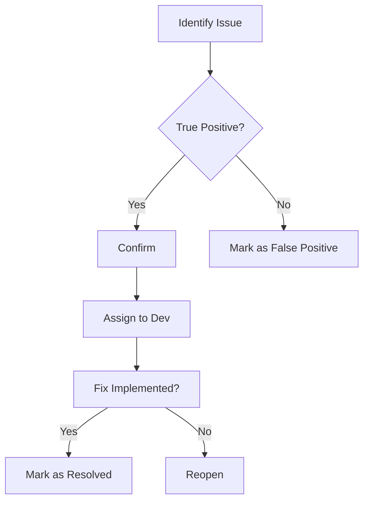
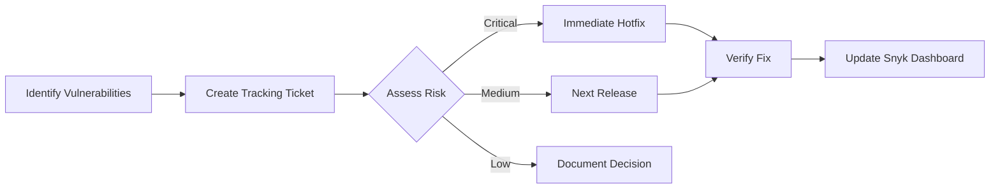
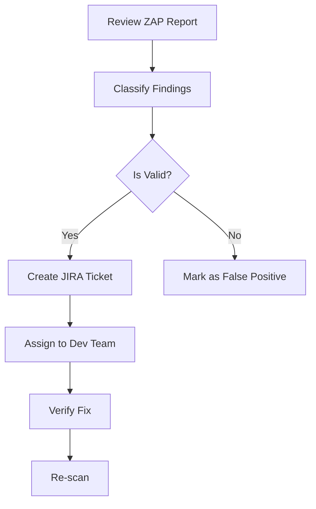
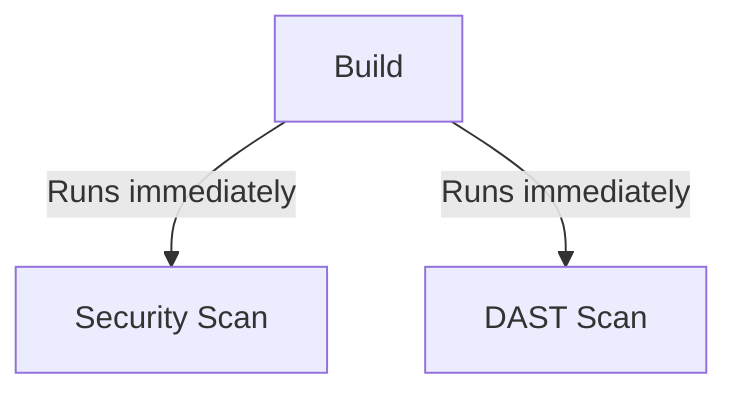
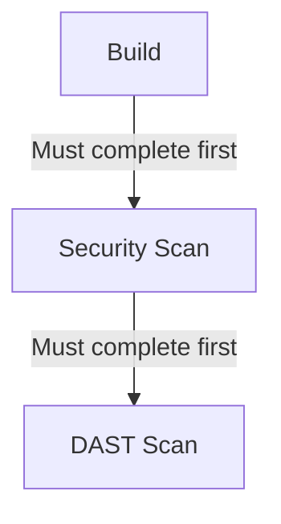

# **DevSecOps Pipeline Implementation Guide for Java Projects**

## **Table of Contents**
1. [Introduction to the Case Study](#introduction-to-the-case-study)
2. [Pipeline Requirements](#pipeline-requirements)
3. [Toolchain Overview](#toolchain-overview)
4. [Implementation Roadmap](#implementation-roadmap)
5. [Expected Outcomes](#expected-outcomes)
6. [Next Steps](#next-steps)

---

## **1. Introduction to the Case Study**
This case study demonstrates how to implement a **complete DevSecOps pipeline** for a Java Maven project using GitHub Actions. The pipeline will integrate:

- **Static Application Security Testing (SAST)** with SonarCloud
- **Software Composition Analysis (SCA)** with Snyk
- **Dynamic Application Security Testing (DAST)** with OWASP ZAP
- **Automated Reporting** of security findings

---

## **2. Pipeline Requirements**
### **Automated Workflow Triggers**
- Pipeline runs on **every code commit** to the repository
- Executes in the following sequence:

### **Pipeline Stages**
1. **Build Phase**
   - Maven compilation and packaging
   - SonarCloud SAST analysis

2. **Dependency Analysis**
   - Snyk scan for vulnerable dependencies

3. **Deployment**
   - Web application deployment (to testing environment)

4. **Security Testing**
   - OWASP ZAP DAST scan

5. **Reporting**
   - Consolidated security reports
   - Notification to developers

---

## **3. Toolchain Overview**
| Tool | Purpose | Key Features |
|------|---------|-------------|
| **SonarCloud** | SAST Analysis | - Code quality metrics<br>- Security hotspots<br>- Bug detection |
| **Snyk** | SCA Analysis | - Open-source vulnerability scanning<br>- License compliance<br>- Dependency upgrade recommendations |
| **OWASP ZAP** | DAST Testing | - Automated web vulnerability scanning<br>- SQLi/XSS detection<br>- Auth testing |
| **GitHub Actions** | Pipeline Orchestration | - CI/CD automation<br>- Secret management<br>- Multi-job workflows |

---

## **4. Implementation Roadmap**
### **Phase 1: SAST with SonarCloud**
1. **SonarCloud Setup**
   - Create organization/project in SonarCloud
   - Generate authentication token

2. **GitHub Actions Integration**
   ```yaml
   - name: SonarCloud Scan
     run: |
       mvn verify sonar:sonar \
         -Dsonar.projectKey=${{ vars.SONAR_PROJECT_KEY }} \
         -Dsonar.login=${{ secrets.SONAR_TOKEN }}
   ```

### **Phase 2: SCA with Snyk**
1. **Snyk Account Setup**
   - Install Snyk GitHub App
   - Configure access token

2. **Workflow Integration**
   ```yaml
   - name: Run Snyk test
     uses: snyk/actions/maven@master
     with:
       args: --org=your-org-name
     env:
       SNYK_TOKEN: ${{ secrets.SNYK_TOKEN }}
   ```

### **Phase 3: DAST with OWASP ZAP**
1. **ZAP Baseline Scan**
   ```yaml
   - name: OWASP ZAP Scan
     uses: zaproxy/action-baseline@v0.7.0
     with:
       target: 'https://your-deployed-app.com'
       rules_file_name: 'security-rules.tsv'
   ```

### **Phase 4: Reporting**
1. **Consolidated Reporting**
   - SonarCloud: Code quality report
   - Snyk: Dependency vulnerability report
   - ZAP: Web security findings

2. **Automated Notifications**
   ```yaml
   - name: Send Slack Alert
     uses: slackapi/slack-github-action@v1
     with:
       payload: |
         {
           "text": "Security scan completed with ${{ job.status }}",
           "attachments": [{
             "title": "View Reports",
             "fields": [
               {"title": "SonarCloud", "value": "${{ steps.sonar.outputs.report-url }}"},
               {"title": "Snyk", "value": "${{ steps.snyk.outputs.report-url }}"}
             ]
           }]
         }
   ```

---

## **5. Expected Outcomes**
### **Security Metrics**
- **Code Quality**: Maintainability rating (A-E)
- **Vulnerabilities**: Critical/High/Medium findings
- **Test Coverage**: Percentage of code covered

### **Sample Report Dashboard**
| Tool | Critical | High | Medium | Low |
|------|----------|------|--------|-----|
| SonarCloud | 2 | 5 | 12 | 8 |
| Snyk | 1 | 3 | 7 | - |
| OWASP ZAP | - | 2 | 4 | 3 |

---
# **DevSecOps Pipeline Implementation Guide: Prerequisites and Setup**

## **Table of Contents**
1. [Introduction](#introduction)
2. [Repository Overview](#repository-overview)
3. [Security Token Requirements](#security-token-requirements)
4. [Generating SonarCloud Token](#generating-sonarcloud-token)
5. [Generating Snyk Token](#generating-snyk-token)
6. [Next Steps](#next-steps)
7. [Troubleshooting](#troubleshooting)

---

## **1. Introduction**
This guide walks through the **prerequisite setup** for implementing a complete DevSecOps pipeline using GitHub Actions. Before executing the pipeline, you need to configure authentication tokens for SonarCloud and Snyk.

---

## **2. Repository Overview**
The demonstration uses a dedicated repository:  
**`DevSecOps-GitHub-actions-all`**

### **Key Components**
- Pre-configured GitHub Actions workflows
- Integration with:
  - SonarCloud (SAST)
  - Snyk (SCA)
  - OWASP ZAP (DAST)
- Sample Java Maven project

> **Note:** Repository link is available in the lecture resources.

---

## **3. Security Token Requirements**
Two critical tokens must be configured in GitHub Secrets before pipeline execution:

| Token Name | Purpose | Where to Generate |
|------------|---------|-------------------|
| `SONAR_TOKEN` | SonarCloud authentication | SonarCloud Account → Security |
| `SNYK_TOKEN` | Snyk authentication | Snyk Account → Settings |

---

## **4. Generating SonarCloud Token**
### **Step-by-Step Guide**
1. Log in to [SonarCloud.io](https://sonarcloud.io)
2. Navigate to:  
   **Account → My Account → Security**
3. Create a new token:
   - **Name:** `GitHub-actions-case-study`
   - Click **Generate**
4. **Copy the token** (only visible once)

### **Adding to GitHub Secrets**
1. Go to your GitHub repo → **Settings → Secrets → Actions**
2. Click **New repository secret**
3. Enter:
   - **Name:** `SONAR_TOKEN`
   - **Value:** Paste the copied token
4. Click **Add secret**


---

## **5. Generating Snyk Token**
### **Step-by-Step Guide**
1. Log in to [Snyk.io](https://snyk.io)
2. Navigate to:  
   **Account Settings → API Token**
3. Click **Show** to reveal your token
4. **Copy the token**

### **Adding to GitHub Secrets**
1. In GitHub repo → **Settings → Secrets → Actions**
2. Click **New repository secret**
3. Enter:
   - **Name:** `SNYK_TOKEN`
   - **Value:** Paste the Snyk token
4. Click **Add secret**

---

## **6. Next Steps**
With tokens configured, proceed to:

1. **Clone the Repository**  
   ```bash
   git clone https://github.com/your-username/DevSecOps-GitHub-actions-all.git
   ```

2. **Review Workflow File**  
   Examine `.github/workflows/complete-workflow.yml` containing:
   - SonarCloud SAST integration
   - Snyk dependency scanning
   - OWASP ZAP DAST testing

3. **Execute Pipeline**  
   Push changes to trigger the workflow:
   ```bash
   git add .
   git commit -m "Configure DevSecOps pipeline"
   git push origin main
   ```

---

## **7. Troubleshooting**
### **Common Issues**
| Problem | Solution |
|---------|----------|
| **Invalid Sonar token** | Regenerate token in SonarCloud and update GitHub Secrets |
| **Snyk scan fails** | Verify `SNYK_TOKEN` has correct permissions |
| **Workflow not triggering** | Check GitHub Actions permissions |

---


---

name: Build code, run unit test, run SAST, SCA, DAST security scans
on: push

jobs:
  build:
    runs-on: ubuntu-latest
    name: Run unit tests and SAST scan on the source code 
    steps:
    - uses: actions/checkout@v4
    - name: Set up JDK 21
      uses: actions/setup-java@v4
      with:
        java-version: '21'
        distribution: 'zulu'
        cache: maven
    - name: Run Sonar Analysis with cloud
      run:  mvn -B verify sonar:sonar -Dsonar.projectKey=dotnetgithubactionsproject -Dsonar.organization=dotnetgithubactionsorg -Dsonar.host.url=https://sonarcloud.io -Dsonar.token=$SONAR_TOKEN
      env:
        GITHUB_TOKEN: ${{ secrets.GITHUB_TOKEN }}
        SONAR_TOKEN: ${{ secrets.SONAR_TOKEN }}
  security:
    runs-on: ubuntu-latest
    needs: build
    name: Run the SCA scan on the source code
    steps:
      - uses: actions/checkout@master
      - name: RunSnyk to check for vulnerabilities
        uses: snyk/actions/maven@master
        continue-on-error: true
        env:
          SNYK_TOKEN: ${{ secrets.SNYK_TOKEN }}
  zap_scan:
    runs-on: ubuntu-latest
    needs: security
    name: Run DAST scan on the web application
    steps:
      - name: Checkout
        uses: actions/checkout@v4
        with:
          ref: master
      - name: ZAP Scan
        uses: zaproxy/action-baseline@v0.14.0
        with:
          target: 'http://testphp.vulnweb.com/'
          rules_file_name: '.zap/rules.tsv'
          cmd_options: '-a'


---


# **DevSecOps Pipeline Implementation: Code Walkthrough and Execution**

## **Table of Contents**
1. [Repository Setup](#repository-setup)
2. [Pipeline Architecture](#pipeline-architecture)
3. [Code Walkthrough](#code-walkthrough)
4. [Executing the Pipeline](#executing-the-pipeline)
5. [Pipeline Monitoring](#pipeline-monitoring)
6. [Next Steps](#next-steps)

---

## **1. Repository Setup**
### **Cloning the Repository**
```bash
git clone https://github.com/your-username/DevSecOps-GitHub-actions-all.git
cd DevSecOps-GitHub-actions-all
```

### **Project Structure**
```
.github/
└── workflows/
    └── complete-workflow.yml  # Main pipeline definition
```

---

## **2. Pipeline Architecture**
The pipeline consists of three key stages:

1. **Build & SAST** (SonarCloud)
2. **SCA** (Snyk) 
3. **DAST** (OWASP ZAP)

### **Workflow Triggers**
```yaml
on: [push]  # Runs on every code push
```

---

## **3. Code Walkthrough**
### **Build & SAST Stage**
```yaml
jobs:
  build:
    runs-on: ubuntu-latest
    steps:
      - name: Run unit tests and SAST
        run: |
          mvn verify sonar:sonar \
            -Dsonar.projectKey=${{ vars.SONAR_PROJECT_KEY }} \
            -Dsonar.organization=${{ vars.SONAR_ORG }} \
            -Dsonar.host.url=https://sonarcloud.io \
            -Dsonar.login=${{ secrets.SONAR_TOKEN }}
```

**Key Components:**
- `mvn verify`: Runs unit tests and generates coverage reports
- `sonar:sonar`: Triggers SonarCloud analysis
- Requires `SONAR_TOKEN` from GitHub Secrets

### **SCA Stage (Snyk)**
```yaml
  security:
    runs-on: ubuntu-latest
    steps:
      - name: Run SCA scan
        uses: snyk/actions/maven@master
        continue-on-error: true  # Prevents build failure on vulnerabilities
        env:
          SNYK_TOKEN: ${{ secrets.SNYK_TOKEN }}
```

**Key Features:**
- Scans Maven dependencies for vulnerabilities
- `continue-on-error` allows pipeline to proceed despite findings

### **DAST Stage (OWASP ZAP)**
```yaml
      - name: Run DAST scan
        uses: zaproxy/action-baseline@v0.7.0
        with:
          target: 'https://testphp.vulnweb.com'  # Demo vulnerable app
          rules_file_name: 'security-rules.tsv'
```

**Security Note:**  
The demo uses a intentionally vulnerable test application. For production:
- Replace with your staging URL
- Obtain proper authorization before scanning

---

## **4. Executing the Pipeline**
### **Committing Changes**
```bash
git add .github/workflows/complete-workflow.yml
git commit -m "Optimize pipeline configuration"
git push origin main
```

### **Pipeline Triggers**
- Automatically starts on push to `main` branch
- View progress in GitHub Actions tab

---

## **5. Pipeline Monitoring**
### **Real-time Logs**
Accessible via:  
`https://github.com/your-username/DevSecOps-GitHub-actions-all/actions`

**Key Log Sections:**
1. **Build Stage**
   - Maven compilation output
   - SonarCloud analysis results

2. **Security Stage**
   - Snyk vulnerability report
   - ZAP scan findings

### **Sample Output**
```log
[INFO] SonarCloud analysis completed
[WARNING] Snyk found 3 high severity vulnerabilities
[ZAP] XSS vulnerability detected at /search.php
```

---
# **Analyzing SonarCloud Results in DevSecOps Pipeline**

## **Table of Contents**
1. [Pipeline Execution Overview](#pipeline-execution-overview)
2. [SonarCloud Analysis Deep Dive](#sonarcloud-analysis-deep-dive)
3. [Interpreting Code Quality Issues](#interpreting-code-quality-issues)
4. [Handling Security Hotspots](#handling-security-hotspots)
5. [Next Steps](#next-steps)

---

## **1. Pipeline Execution Overview**
The DevSecOps pipeline executed three key stages:
1. **Build & SAST** (SonarCloud)
2. **SCA** (Snyk)
3. **DAST** (OWASP ZAP)

### **Key Log Sections**
```log
[INFO] SonarCloud analysis completed
[WARNING] 8 code smells identified
[SECURITY] 1 security hotspot detected
```

---

## **2. SonarCloud Analysis Deep Dive**
### **Accessing Results**
1. Navigate to SonarCloud dashboard
2. Select your project (`java-reachability-playground` in demo)
3. Review:
   - **Code Smells** (Maintainability)
   - **Security Hotspots** (Potential vulnerabilities)
   - **Coverage** (Test coverage metrics)

### **Sample Metrics**
| Metric | Value |
|--------|-------|
| Code Smells | 8 |
| Security Hotspots | 1 |
| Coverage | 78% |

---

## **3. Interpreting Code Quality Issues**
### **Common Code Smells**
1. **Duplicate Code**
   - Files: `Controller.java`, `Service.java`
   - Recommendation: Extract common logic

2. **Complex Methods**
   - Method: `calculateRiskScore()`
   - Cyclomatic Complexity: 12 (Threshold: 10)

3. **Hardcoded Credentials**
   - File: `DatabaseConfig.java`
   - Risk: Medium

### **Action Workflow**


---

## **4. Handling Security Hotspots**
### **Example: `evil.txt` File**
1. **Issue Identified**
   - File: `src/resources/evil.txt`
   - Risk Level: Low
   - Description: Suspicious filename pattern

2. **Resolution Process**
   - **Analysis**: Determined to be test file (false positive)
   - **Action**:
     ```text
     Status: Safe
     Comment: "Test file intentionally named - no actual risk"
     ```

### **Hotspot Status Options**
| Status | When to Use |
|--------|-------------|
| Safe | No actual risk |
| Fixed | Vulnerability remediated |
| Acknowledged | Risk accepted with justification |

---

### **Production Recommendations**
1. **Integrate with Ticketing Systems**
   - Automatically create Jira tickets for confirmed issues
2. **Set Quality Gates**
   - Fail builds on critical vulnerabilities
3. **Weekly Security Reviews**
   - Triage meetings with development team

```yaml
# Example Quality Gate
qualityGate:
  conditions:
    - metric: new_security_hotspots
      op: GT
      value: 0
      error: true
```

---

# **Analyzing Snyk SCA Results in DevSecOps Pipeline**

## **Table of Contents**
1. [SCA Scan Overview](#sca-scan-overview)
2. [Vulnerability Analysis](#vulnerability-analysis)
3. [Prioritizing Fixes](#prioritizing-fixes)
4. [Remediation Workflow](#remediation-workflow)
5. [Next Steps](#next-steps)

---

## **1. SCA Scan Overview**
The Software Composition Analysis (SCA) scan using Snyk identified:

- **14 dependencies** analyzed
- **14 vulnerabilities** found across:
  - `com.google.guava` (Google Core Libraries)
  - `org.apache.commons` (Apache Commons)
  - Other third-party libraries

### **Key Metrics**
| Severity | Count |
|----------|-------|
| High | 1 |
| Medium | 5 |
| Low | 8 |

---

## **2. Vulnerability Analysis**
### **Critical Findings**
#### **1. Denial of Service (High)**
- **Library**: `org.apache.commons:commons-compress`
- **Version**: 1.16.1 (Vulnerable) → **Fixed in 1.19+**
- **CVE**: CVE-2021-35515
- **Impact**: Malicious archives can cause OOM crashes

#### **2. Deserialization of Untrusted Data (Medium)**
- **Library**: `com.google.guava:guava`
- **Version**: 20.0 → **Fixed in 24.1.1+**
- **CVE**: CVE-2018-10237
- **Impact**: Potential RCE via serialized objects

### **Sample Output**
```log
✗ Medium severity vulnerability found in com.google.guava/guava
  Description: Deserialization of Untrusted Data
  Fixed in: 24.1.1
  Current version: 20.0
  Path: pom.xml > com.google.guava:guava:20.0
```

---

## **3. Prioritizing Fixes**
### **Recommended Action Plan**
1. **Immediate Fix (High Severity)**
   - Upgrade `commons-compress` to ≥1.19
   ```xml
   <!-- pom.xml -->
   <dependency>
     <groupId>org.apache.commons</groupId>
     <artifactId>commons-compress</artifactId>
     <version>1.21</version> <!-- Latest stable -->
   </dependency>
   ```

2. **Scheduled Fixes (Medium Severity)**
   - Update Guava to ≥24.1.1 in next sprint

3. **Monitor (Low Severity)**
   - Document risk acceptance for info disclosure issues

---

## **4. Remediation Workflow**
### **Security Engineer Responsibilities**


### **Tools Integration**
- **Jira Integration**: Automatically create tickets from Snyk findings
- **Slack Alerts**: Notify teams about critical vulnerabilities
- **Dependabot**: Enable automated dependency updates

---

### **Production Recommendations**
1. **Enforce SCA in CI**
   ```yaml
   # GitHub Actions Snippet
   - name: Snyk Security Check
     uses: snyk/actions/maven@master
     with:
       fail-on: medium # Fail build on medium+ severity
   ```

2. **Monthly Dependency Reviews**
   - Cross-team meetings to assess third-party risks

---

# **Analyzing OWASP ZAP DAST Scan Results**

## **Table of Contents**
1. [DAST Scan Overview](#dast-scan-overview)
2. [Understanding the Findings](#understanding-the-findings)
3. [Prioritizing Vulnerabilities](#prioritizing-vulnerabilities)
4. [Remediation Workflow](#remediation-workflow)
5. [Reporting and Tracking](#reporting-and-tracking)
6. [Next Steps](#next-steps)

---

## **1. DAST Scan Overview**
The OWASP ZAP (Zed Attack Proxy) scan identified multiple security issues in the test application (`testphp.vulnweb.com`).

### **Key Artifacts Generated**
1. **GitHub Issues Report** (Automatically created)
2. **ZAP Scan Report** (HTML format)
3. **Email Notification** (Sent to registered GitHub email)

### **Scan Statistics**
| Severity | Count |
|----------|-------|
| Medium | 3 |
| Low | 5 |
| Informational | 6 |

---

## **2. Understanding the Findings**
### **Critical Vulnerabilities Found**
1. **Missing Anti-CSRF Tokens** (11 instances)
   - **Risk**: Allows CSRF attacks
   - **Example Paths**: `/login`, `/update_profile`

2. **Content Security Policy Missing** (11 instances)
   - **Risk**: XSS attacks possible
   - **Affected Pages**: All pages

3. **Clickjacking Protection Missing** (11 instances)
   - **Risk**: UI redressing attacks
   - **Solution**: Add `X-Frame-Options` header

### **Sample Report Excerpt**
```html
<tr>
  <td>Medium</td>
  <td>Absence of Anti-CSRF Tokens</td>
  <td>11</td>
  <td>Forms without CSRF protection</td>
</tr>
```

---

## **3. Prioritizing Vulnerabilities**
### **Remediation Priority Matrix**
| Severity | Response Time | Example Issues |
|----------|--------------|----------------|
| **Critical** | Immediate | SQL Injection, RCE |
| **High** | Next Patch | Missing Auth Controls |
| **Medium** | Next Release | CSRF, Missing Headers |
| **Low** | Scheduled | Info Disclosure |

### **Recommended Fixes**
1. **Immediate Actions**:
   ```java
   // Spring Security CSRF Example
   @Configuration
   public class SecurityConfig extends WebSecurityConfigurerAdapter {
       @Override
       protected void configure(HttpSecurity http) throws Exception {
           http.csrf().csrfTokenRepository(CookieCsrfTokenRepository.withHttpOnlyFalse());
       }
   }
   ```

2. **Security Headers**:
   ```nginx
   # Nginx configuration
   add_header X-Frame-Options "DENY";
   add_header Content-Security-Policy "default-src 'self'";
   add_header X-Content-Type-Options "nosniff";
   ```

---

## **4. Remediation Workflow**
### **Security Engineer Process**


### **Tools Integration**
- **JIRA Integration**: Automatically create tickets from ZAP findings
- **Slack Alerts**: Notify security channel about critical issues
- **Confluence**: Maintain vulnerability knowledge base

---

## **5. Reporting and Tracking**
### **Effective Reporting Practices**
1. **Executive Summary**:
   - Total vulnerabilities found
   - Risk distribution (Critical/High/Medium)
   - Estimated remediation timeline

2. **Technical Details**:
   ```markdown
   ## Vulnerability: Missing CSP Header
   - **Severity**: Medium
   - **Affected Pages**: All
   - **Solution**: 
     ```nginx
     add_header Content-Security-Policy "default-src 'self'";
     ```
   - **Reference**: [OWASP CSP Cheat Sheet](https://cheatsheetseries.owasp.org/cheatsheets/Content_Security_Policy_Cheat_Sheet.html)
   ```

3. **Metrics Dashboard**:
   ```
   Vulnerabilities by Type
   ├── Configuration (45%)
   ├── Authentication (30%)
   └── Input Validation (25%)
   ```

---

## **6. Next Steps**
### **Production Recommendations**
1. **Scan Authorization**:
   - Always get written permission before scanning
   - Use `robots.txt` and `security.txt` for guidance

2. **Scheduled Scans**:
   ```yaml
   # GitHub Actions Snippet
   on:
     schedule:
       - cron: '0 0 * * 1' # Weekly scans
   ```

3. **Advanced Configurations**:
   - Authenticated scanning for privileged flows
   - API scanning with OpenAPI/Swagger specs

---

# **Understanding Job Dependencies in GitHub Actions with `needs` Keyword**

## **Table of Contents**
1. [Introduction to Job Dependencies](#introduction-to-job-dependencies)
2. [Sequential vs Parallel Execution](#sequential-vs-parallel-execution)
3. [Implementing the `needs` Keyword](#implementing-the-needs-keyword)
4. [Performance Considerations](#performance-considerations)
5. [Best Practices](#best-practices)
6. [Next Steps](#next-steps)

---

## **1. Introduction to Job Dependencies**
The `needs` keyword in GitHub Actions establishes explicit dependencies between jobs, ensuring:
- **Ordered execution** (Job B runs only after Job A completes)
- **Data sharing** between dependent jobs
- **Failure handling** (Downstream jobs won't run if upstream fails)

### **Key Use Cases**
1. Build → Test → Deploy workflows
2. Security scans requiring build artifacts
3. Multi-environment deployments

---

## **2. Sequential vs Parallel Execution**
### **Without `needs` (Default Parallel Execution)**

- **Pros**: Faster (~1 minute in demo)
- **Cons**: Risk of race conditions

### **With `needs` (Sequential Execution)**

- **Pros**: Reliable ordering (~3.5 minutes in demo)
- **Cons**: Longer total runtime

---

## **3. Implementing the `needs` Keyword**
### **Workflow Configuration**
```yaml
jobs:
  build:
    runs-on: ubuntu-latest
    steps: [...]

  security:
    needs: build  # Waits for build job
    runs-on: ubuntu-latest
    steps: [...]

  dast:
    needs: security  # Waits for security job
    runs-on: ubuntu-latest
    steps: [...]
```

### **Execution Timeline Comparison**
| Configuration | Build Time | Security Scan | DAST Scan | Total |
|--------------|-----------|--------------|----------|-------|
| Parallel | 1m 30s | 37s | 1m | ~1m |
| Sequential | 1m 30s → | 37s → | 1m | ~3m 39s |

---

## **4. Performance Considerations**
### **When to Use Sequential**
1. **Dependent Artifacts**: Security scans needing build outputs
2. **Cost-Sensitive**: Avoid parallel runner costs
3. **Validation Requirements**: Tests must pass before deployment

### **When to Use Parallel**
1. **Independent Jobs**: Linting vs unit tests
2. **Time-Critical Pipelines**: Fast CI feedback
3. **Resource Availability**: Sufficient concurrent runners

---

## **5. Best Practices**
### **Hybrid Approach Example**
```yaml
jobs:
  lint:
    runs-on: ubuntu-latest
  test:
    runs-on: ubuntu-latest
  build:
    needs: [lint, test]  # Parallel lint+test, then build
    runs-on: ubuntu-latest
```

### **Optimization Tips**
1. **Cache Dependencies**: Reduce repetitive setup
   ```yaml
   - uses: actions/cache@v3
     with:
       path: ~/.m2
       key: ${{ runner.os }}-maven-${{ hashFiles('**/pom.xml') }}
   ```
2. **Matrix Builds**: Parallelize similar jobs
3. **Manual Approvals**: For critical stages
   ```yaml
   deploy:
     needs: test
     if: github.event_name == 'workflow_dispatch'
   ```

---


### **Advanced Configurations**
1. **Fan-out/Fan-in Patterns**
   ```yaml
   build-all:
     needs: [build-frontend, build-backend]
   ```
2. **Dynamic Dependencies**
   ```yaml
   needs: ${{ fromJSON(needs.job.outputs.dependencies) }}
   ```

### **Production Recommendations**
1. **Monitor Job Durations**: GitHub Actions metrics
2. **Set Timeouts**: Prevent hung jobs
   ```yaml
   timeout-minutes: 30
   ```
3. **Error Handling**: Continue on non-critical failures
   ```yaml
   continue-on-error: true
   ```

---


