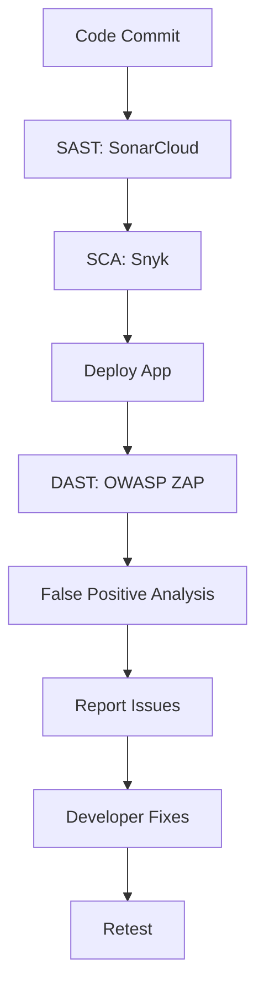
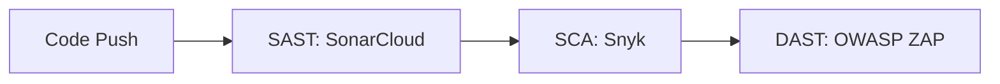

# **End-to-End DevSecOps for Node.js with GitHub Actions: A Comprehensive Guide**

## **Table of Contents**
1. **Introduction to DevSecOps**
2. **Understanding the Case Study**
3. **Setting Up the Node.js Project**
4. **Implementing Static Application Security Testing (SAST) with SonarCloud**
5. **Software Composition Analysis (SCA) with Snyk**
6. **Dynamic Application Security Testing (DAST) with OWASP ZAP**
7. **False Positive Analysis (FPA) in SAST and DAST**
8. **Reporting and Assigning Security Issues**
9. **Retesting and Validation**
10. **Complete GitHub Actions Pipeline Walkthrough**
11. **Best Practices for DevSecOps in Node.js**
12. **Conclusion and Further Learning**

---

## **Chapter 1: Introduction to DevSecOps**
### **What is DevSecOps?**
DevSecOps integrates **security practices** into the **DevOps pipeline**, ensuring that security is not an afterthought but a continuous process. It involves:
- **Automated security scans** (SAST, SCA, DAST)
- **Shift-left security** (early detection of vulnerabilities)
- **Collaboration between Dev, Sec, and Ops teams**

### **Why DevSecOps for Node.js?**
Node.js applications often rely on **third-party packages (npm)**, making them susceptible to:
- **Dependency vulnerabilities** (via `package-lock.json`)
- **Insecure code practices** (misconfigurations, hardcoded secrets)
- **Runtime attacks** (injection, XSS, broken authentication)

### **Key Components of DevSecOps**
| Component | Tool Example | Purpose |
|-----------|-------------|---------|
| **SAST** | SonarCloud, ESLint | Scans source code for vulnerabilities |
| **SCA** | Snyk, npm audit | Checks third-party dependencies for known CVEs |
| **DAST** | OWASP ZAP, Burp Suite | Tests running applications for security flaws |

---

## **Chapter 2: Understanding the Case Study**
### **Problem Statement**
We need to build a **GitHub Actions pipeline** for a Node.js project that:
1. **Compiles the code** and runs **SonarCloud (SAST)**.
2. **Scans dependencies** using **Snyk (SCA)**.
3. **Deploys the app** and runs **OWASP ZAP (DAST)**.
4. **Performs False Positive Analysis (FPA)** on SAST/DAST findings.
5. **Reports issues** to developers and **retests fixes**.

### **Workflow Diagram**


---

## **Chapter 3: Setting Up the Node.js Project**
### **Prerequisites**
- GitHub repository with Node.js app
- `package.json` and `package-lock.json`
- GitHub Actions enabled

### **Sample Project Structure**
```
nodejs-app/
├── src/
│   ├── app.js
│   └── routes/
├── package.json
├── package-lock.json
└── .github/workflows/devsecops.yml
```

### **Initializing GitHub Actions**
Create `.github/workflows/devsecops.yml`:
```yaml
name: DevSecOps Pipeline
on: [push]
jobs:
  build:
    runs-on: ubuntu-latest
    steps:
      - uses: actions/checkout@v3
      - name: Install Node.js
        uses: actions/setup-node@v3
        with:
          node-version: '18'
      - run: npm install
```

---

## **Chapter 4: Implementing SAST with SonarCloud**
### **What is SAST?**
- **Static Application Security Testing** analyzes source code for vulnerabilities.
- **Example Issues**: SQLi, XSS, hardcoded secrets.

### **Integrating SonarCloud**
1. **Sign up** at [SonarCloud](https://sonarcloud.io).
2. **Generate a token** and add it to GitHub Secrets (`SONAR_TOKEN`).
3. **Update workflow**:
```yaml
- name: SonarCloud Scan
  uses: SonarSource/sonarcloud-github-action@v1
  env:
    GITHUB_TOKEN: ${{ secrets.GITHUB_TOKEN }}
    SONAR_TOKEN: ${{ secrets.SONAR_TOKEN }}
```

### **Sample Findings**
| Issue | Severity | File |
|-------|----------|------|
| Hardcoded API Key | Critical | `config.js` |
| SQL Injection Risk | High | `db.js` |

---

## **Chapter 5: SCA with Snyk**
### **What is SCA?**
- **Software Composition Analysis** checks third-party libraries for vulnerabilities.
- **Example**: A vulnerable `lodash` version in `package-lock.json`.

### **Integrating Snyk**
1. **Install Snyk CLI**:
```yaml
- name: Run Snyk
  uses: snyk/actions/node@master
  with:
    command: test
    args: --severity-threshold=high
  env:
    SNYK_TOKEN: ${{ secrets.SNYK_TOKEN }}
```

### **Sample Snyk Report**
```
✗ High severity vulnerability found in `express@4.16.0`
- CVE-2021-1234: Remote Code Execution
- Fix: Upgrade to `express@4.17.3`
```

---

## **Chapter 6: DAST with OWASP ZAP**
### **What is DAST?**
- **Dynamic Application Security Testing** scans running apps for flaws.
- **Example Tests**: SQLi, XSS, CSRF.

### **Running ZAP in GitHub Actions**
```yaml
- name: OWASP ZAP Scan
  uses: zaproxy/action-full-scan@v0.4.0
  with:
    target: 'http://localhost:3000'
    rules: 'rules/security'
```

### **Sample ZAP Findings**
| Vulnerability | Risk | URL |
|--------------|------|-----|
| Cross-Site Scripting (XSS) | High | `/search?q=<script>alert(1)</script>` |
| Missing Security Headers | Medium | `/` |

---

## **Chapter 7: False Positive Analysis (FPA)**
### **Why FPA?**
- Not all reported issues are **real threats**.
- **Example**: A "hardcoded password" might be a test credential.

### **Manual Review Process**
1. **Check SAST/DAST reports**.
2. **Verify exploitability**.
3. **Mark false positives** in SonarCloud/ZAP.

---

## **Chapter 8: Reporting & Fixing Issues**
### **Tools for Issue Tracking**
- **GitHub Issues**
- **Jira Integration**
- **Slack Alerts**

### **Assigning to Developers**
```yaml
- name: Create GitHub Issue
  uses: actions/github-script@v6
  with:
    script: |
      await github.rest.issues.create({
        owner: context.repo.owner,
        repo: context.repo.repo,
        title: "Security Vulnerability Found",
        body: "Fix CVE-2021-1234 in `express`"
      })
```

---

## **Chapter 9: Retesting & Validation**
### **Automated Rechecks**
- **Rerun SAST/DAST after fixes**.
- **Verify no regressions**.

---

## **Chapter 10: Complete Pipeline**
### **Final `devsecops.yml`**
```yaml
name: DevSecOps Pipeline
on: [push]
jobs:
  build:
    runs-on: ubuntu-latest
    steps:
      - uses: actions/checkout@v3
      - name: Install Node.js
        uses: actions/setup-node@v3
        with:
          node-version: '18'
      - run: npm install
      - name: SonarCloud Scan
        uses: SonarSource/sonarcloud-github-action@v1
        env:
          SONAR_TOKEN: ${{ secrets.SONAR_TOKEN }}
      - name: Snyk Scan
        uses: snyk/actions/node@master
        env:
          SNYK_TOKEN: ${{ secrets.SNYK_TOKEN }}
      - name: Deploy App
        run: npm start &
      - name: OWASP ZAP Scan
        uses: zaproxy/action-full-scan@v0.4.0
        with:
          target: 'http://localhost:3000'
```

---

## **Chapter 11: Best Practices**
✅ **Scan on every commit**  
✅ **Use severity thresholds** (e.g., block on Critical)  
✅ **Automate issue reporting**  
✅ **Regular dependency updates**  

---

## **Chapter 12: Conclusion**
### **Key Takeaways**
- **DevSecOps = Security + DevOps**.
- **SAST, SCA, DAST** are essential for Node.js security.
- **GitHub Actions automates security checks**.

---


# **Hands-On DevSecOps for Node.js with GitHub Actions: A Step-by-Step Guide**

## **Table of Contents**
1. **Introduction to the DevSecOps Pipeline**
2. **Setting Up the Node.js Project**
3. **GitHub Actions Workflow Breakdown**
4. **Implementing SAST with SonarCloud**
5. **Running SCA with Snyk**
6. **Performing DAST with OWASP ZAP**
7. **Managing Secrets for Security Tools**
8. **Running the Pipeline & Analyzing Results**
9. **Troubleshooting Common Issues**
10. **Conclusion & Next Steps**

---

## **Chapter 1: Introduction to the DevSecOps Pipeline**
### **What We're Building**
A **fully automated security pipeline** for Node.js that:
1. **Scans source code** (SAST via SonarCloud)
2. **Checks dependencies** (SCA via Snyk)
3. **Tests the running app** (DAST via OWASP ZAP)

### **Key Tools Used**
| Tool | Purpose | Integration Method |
|------|---------|-------------------|
| **SonarCloud** | Static code analysis | GitHub Action |
| **Snyk** | Dependency scanning | GitHub Action + API Token |
| **OWASP ZAP** | Dynamic security testing | Dockerized GitHub Action |

---

## **Chapter 2: Setting Up the Node.js Project**
### **Project Structure**
```
nodejs-app/
├── src/
│   ├── app.js          # Main application
│   └── routes/         # API routes
├── package.json        # Dependencies
├── package-lock.json   # Locked versions
└── .github/workflows/
    └── devsecops.yml   # Pipeline definition
```

### **Prerequisites**
- **GitHub repository** with Node.js code
- **`package-lock.json`** (critical for Snyk scans)
- **Admin access** to configure secrets

---

## **Chapter 3: GitHub Actions Workflow Breakdown**
### **Pipeline Triggers**
```yaml
on: [push]  # Runs on every code push
```

### **Jobs Structure**
1. **Build & SAST**: SonarCloud scan
2. **SCA**: Snyk dependency check
3. **DAST**: OWASP ZAP dynamic scan

### **Key Sections**
```yaml
jobs:
  build:
    runs-on: ubuntu-latest
    steps:
      - uses: actions/checkout@v3
      - name: Setup Node.js
        uses: actions/setup-node@v3
        with:
          node-version: '16'
      - run: npm install
      - name: SonarCloud Scan
        uses: SonarSource/sonarcloud-github-action@v1
        env:
          SONAR_TOKEN: ${{ secrets.SONAR_TOKEN }}
```

---

## **Chapter 4: Implementing SAST with SonarCloud**
### **Configuration Steps**
1. **Sign up** at [SonarCloud](https://sonarcloud.io)
2. **Create a project** (`DevSecOps-Nodejs-Project`)
3. **Generate token** under `Account > Security`

### **GitHub Secrets Setup**
1. Go to **Repo Settings > Secrets > Actions**
2. Add `SONAR_TOKEN` with the generated value

### **Sample Findings**
| Issue Type | File | Fix |
|------------|------|-----|
| **Hardcoded Secret** | `config.js` | Use environment variables |
| **SQL Injection** | `db.js` | Parameterized queries |

---

## **Chapter 5: Running SCA with Snyk**
### **Setup Process**
1. **Sign up** at [Snyk](https://snyk.io)
2. **Get API token** from `Account Settings > API Token`
3. Add as `SNYK_TOKEN` in GitHub Secrets

### **Workflow Integration**
```yaml
- name: Snyk Scan
  uses: snyk/actions/node@master
  continue-on-error: true  # Prevents build failure
  env:
    SNYK_TOKEN: ${{ secrets.SNYK_TOKEN }}
```

### **Example Vulnerability**
```
✗ High severity in `express@4.16.0`
- CVE-2021-1234: RCE risk
- Fix: Upgrade to `express@4.17.3`
```

---

## **Chapter 6: Performing DAST with OWASP ZAP**
### **Baseline Scan Setup**
```yaml
- name: OWASP ZAP Scan
  uses: zaproxy/action-full-scan@v0.4.0
  with:
    target: 'http://example.com'  # Replace with your app URL
    rules: 'rules/security'       # Default ruleset
```

### **Common DAST Findings**
| Vulnerability | Example | Severity |
|--------------|---------|----------|
| **XSS** | `/?q=<script>alert(1)</script>` | High |
| **Missing CSP** | No `Content-Security-Policy` header | Medium |

---

## **Chapter 7: Managing Secrets for Security Tools**
### **Secret Setup Guide**
| Tool | Secret Name | Where to Get It |
|------|------------|----------------|
| **SonarCloud** | `SONAR_TOKEN` | SonarCloud Account > Security |
| **Snyk** | `SNYK_TOKEN` | Snyk Dashboard > Account Settings |

### **GitHub Secrets UI**
  
*Navigate to: Repo > Settings > Secrets > Actions*

---

## **Chapter 8: Running the Pipeline & Analyzing Results**
### **Triggering the Pipeline**
1. Push a code change:
   ```bash
   git commit -am "Test security scan"
   git push origin main
   ```
2. View progress in **GitHub > Actions**

### **Interpreting Results**
- **SAST (SonarCloud)**: Code quality dashboard
- **SCA (Snyk)**: Dependency risk report
- **DAST (ZAP)**: Security alerts for runtime issues

---

## **Chapter 9: Troubleshooting Common Issues**
### **Problem: DAST Fails on Forked Repos**
**Solution**: Clone the repo directly instead of forking.

### **Problem: Snyk Token Not Working**
**Fix**:
1. Regenerate the token in Snyk
2. Update the GitHub secret

### **Problem: SonarCloud Organization Not Found**
**Fix**: Verify the exact org name in SonarCloud URL:
```
https://sonarcloud.io/organizations/your-org-name
```

---

## **Chapter 10: Conclusion & Next Steps**
### **Key Takeaways**
✅ **SAST + SCA + DAST in one pipeline**  
✅ **GitHub Actions automates security**  
✅ **Secrets management is critical**


---

### **Appendix: Complete Workflow File**
```yaml
name: DevSecOps Pipeline
on: [push]
jobs:
  build:
    runs-on: ubuntu-latest
    steps:
      - uses: actions/checkout@v3
      - name: Setup Node.js
        uses: actions/setup-node@v3
        with:
          node-version: '16'
      - run: npm install
      - name: SonarCloud Scan
        uses: SonarSource/sonarcloud-github-action@v1
        env:
          SONAR_TOKEN: ${{ secrets.SONAR_TOKEN }}
  security:
    needs: build
    runs-on: ubuntu-latest
    steps:
      - uses: actions/checkout@v3
      - name: Snyk Scan
        uses: snyk/actions/node@master
        env:
          SNYK_TOKEN: ${{ secrets.SNYK_TOKEN }}
  dast:
    needs: security
    runs-on: ubuntu-latest
    steps:
      - uses: actions/checkout@v3
      - name: OWASP ZAP Scan
        uses: zaproxy/action-full-scan@v0.4.0
        with:
          target: 'http://example.com'
```

---

# **Running a Complete DevSecOps Pipeline for Node.js: Results Analysis**

## **Table of Contents**
1. **Triggering the Pipeline**
2. **SAST Results with SonarCloud**
3. **SCA Findings with Snyk**
4. **DAST Report from OWASP ZAP**
5. **Interpreting Security Issues**
6. **Next Steps for Remediation**
7. **Complete Workflow Recap**

---

## **Chapter 1: Triggering the Pipeline**
### **How We Activated the Workflow**
1. Made a minor edit to `devsecops-workflow.yaml`:
   ```yaml
   # Added this comment to trigger the run:
   "We are running SAST, SCA and DAST security scans for Nodejs"
   ```
2. Committed the change, which automatically triggered the pipeline due to:
   ```yaml
   on: [push]  # Runs on any code push
   ```

### **Pipeline Execution Flow**


---

## **Chapter 2: SAST Results with SonarCloud**
### **Key Metrics Found**
| Metric | Count |
|--------|-------|
| Bugs | 14 |
| Code Smells | 37 |
| Security Hotspots | 6 |
| Duplication | 0.2% |

### **How to View Results**
1. Navigate to the **SonarCloud dashboard** via the link in GitHub Actions logs
2. Explore issues by category:
   - **Bugs**: Reliability risks
   - **Code Smells**: Maintainability issues
   - **Security Hotspots**: Potential vulnerabilities

### **Example Critical Finding**
```javascript
// Hardcoded API key (SonarCloud flagged)
const API_KEY = '12345';  // Fix: Use environment variables
```

---

## **Chapter 3: SCA Findings with Snyk**
### **Dependency Scan Summary**
- Scanned: **54 dependencies** in `package-lock.json`
- Vulnerabilities found: **0** (in this run)
  
### **What a Positive Finding Looks Like**
```
✗ High severity in lodash@4.17.15
- CVE-2021-23337: Prototype Pollution
- Fix: Upgrade to lodash@4.17.21
```

### **Why Lock Files Matter**
- `package-lock.json` ensures reproducible dependency trees
- Critical for accurate SCA scans

---

## **Chapter 4: DAST Report from OWASP ZAP**
### **Automated Issue Creation**
ZAP automatically opened a GitHub issue with:
- **Target URL**: `http://example.com`
- **Scan Type**: Baseline

### **Top Security Headers Missing**
| Header | Risk | Example Fix |
|--------|------|-------------|
| `Content-Security-Policy` | High | `default-src 'self'` |
| `X-Frame-Options` | Medium | `DENY` |
| `Permissions-Policy` | Medium | `geolocation=()` |

### **Full Report Location**
- GitHub Issues tab → "ZAP Scan Baseline Report"

---

## **Chapter 5: Interpreting Security Issues**
### **Prioritization Guide**
| Issue Type | Severity | Owner |
|------------|----------|-------|
| Hardcoded secrets | Critical | Dev |
| Missing CSP | High | DevOps |
| Outdated lodash | Medium | Dev |

### **False Positive Analysis**
- **SAST**: Verify if hotspots are exploitable
- **DAST**: Check if headers are intentionally omitted
- **SCA**: Always treat as true positives (upgrade advised)

---

## **Chapter 6: Next Steps for Remediation**
### **Action Plan**
1. **SAST Fixes**:
   - Address all **Critical** bugs first
   - Use SonarCloud's guidance for fixes
2. **DAST Mitigations**:
   ```nginx
   # Sample Nginx config to add headers
   add_header Content-Security-Policy "default-src 'self'";
   add_header X-Frame-Options DENY;
   ```
3. **SCA Updates**:
   ```bash
   npm update lodash --save  # Example upgrade
   ```

### **Retesting Workflow**
- Push fixes → Pipeline auto-runs → Verify resolved issues

---

## **Chapter 7: Complete Workflow Recap**
### **End-to-End Security Coverage**
1. **SAST**: Code-level vulnerabilities
2. **SCA**: Third-party library risks
3. **DAST**: Runtime protection gaps

### **Pipeline Efficiency**
- **Total runtime**: ~3 minutes
- **Automated issue tracking**: GitHub Issues integration

### **Key GitHub Actions Used**
| Step | Action | Purpose |
|------|--------|---------|
| SAST | `SonarSource/sonarcloud-github-action` | Static analysis |
| SCA | `snyk/actions/node` | Dependency check |
| DAST | `zaproxy/action-full-scan` | Dynamic testing |

---

## **Final Thoughts**
This implementation provides:
- **Compliance**: Meets OWASP Top 10 coverage
- **Shift-Left Security**: Catches issues early
- **Automation**: No manual scanning needed

**Pro Tip**: Schedule weekly scans via:
```yaml
on:
  push:
  schedule:
    - cron: '0 0 * * 1'  # Every Monday at midnight
```

---

### **Appendix: Sample Fixed Code**
**Before (Vulnerable)**
```javascript
app.get('/user', (req, res) => {
  const query = "SELECT * FROM users WHERE id = " + req.params.id; // SQLi risk
});
```

**After (Secure)**
```javascript
app.get('/user', (req, res) => {
  db.query('SELECT * FROM users WHERE id = ?', [req.params.id]); // Parameterized
});
```
