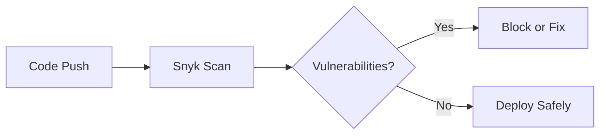

# **Integrating Snyk with GitHub Actions: Complete Guide**

## **Table of Contents**
1. [Introduction to Snyk-GitHub Integration](#introduction)
2. [Prerequisites](#prerequisites)
3. [Step-by-Step Integration](#integration-steps)
4. [Understanding the Workflow File](#workflow-explanation)
5. [Handling Scan Results](#handling-results)
6. [Best Practices](#best-practices)
7. [Troubleshooting](#troubleshooting)
8. [Conclusion](#conclusion)

---

## **1. Introduction to Snyk-GitHub Integration** <a name="introduction"></a>
Snyk's integration with GitHub Actions enables **automated security scanning** of your:
- **Dependencies** (SCA - Software Composition Analysis)
- **Containers**
- **Infrastructure as Code (IaC)**

**Key Benefits**:
✅ **Shift-Left Security** - Catch vulnerabilities early  
✅ **Automated PR Fixes** - Snyk suggests patches  
✅ **CI/CD Pipeline Integration** - No manual scans needed  

---

## **2. Prerequisites** <a name="prerequisites"></a>
Before starting, ensure you have:
1. **Snyk Account** ([Sign up here](https://snyk.io))
2. **GitHub Repository** (We'll use Snyk's [vulnerable Java demo repo](https://github.com/snyk-labs/java-reachability-ground))
3. **GitHub Actions Enabled** (For your repo)

---

## **3. Step-by-Step Integration** <a name="integration-steps"></a>

### **Step 1: Fork the Vulnerable Repository**
```bash
# Fork Snyk's vulnerable Java repo:
https://github.com/snyk-labs/java-reachability-ground
```
- This contains intentional vulnerabilities for testing.

### **Step 2: Get Your Snyk API Token**
1. Log in to [Snyk.io](https://snyk.io)
2. Navigate to: **Account Settings → API Token**
3. Copy the token (we'll add it to GitHub Secrets)

### **Step 3: Add Snyk Token to GitHub Secrets**
1. Go to your GitHub repo → **Settings → Secrets → Actions**
2. Click **New Repository Secret**
3. Name: `SNYK_TOKEN`  
   Value: `[Your-Snyk-API-Token]`

### **Step 4: Create the GitHub Actions Workflow**
1. In your repo, create:  
   `.github/workflows/snyk-scan.yml`
2. Paste this YAML:

```yaml
name: Snyk Security Scan

on: [push, pull_request]

jobs:
  security:
    runs-on: ubuntu-latest
    steps:
      - uses: actions/checkout@v3
      - name: Run Snyk to check for vulnerabilities
        uses: snyk/actions/maven@master
        env:
          SNYK_TOKEN: ${{ secrets.SNYK_TOKEN }}
        with:
          args: --fail-on=upgradable
```

### **Step 5: Trigger the Scan**
- Commit the file → GitHub Actions will automatically run Snyk.

---

## **4. Understanding the Workflow File** <a name="workflow-explanation"></a>

| Key Section | Purpose | Example |
|-------------|---------|---------|
| **`on`** | Triggers the workflow | `push`, `pull_request` |
| **`jobs`** | Defines scanning job | `security` |
| **`runs-on`** | OS environment | `ubuntu-latest` |
| **`SNYK_TOKEN`** | Authenticates Snyk | GitHub Secret |
| **`args`** | Scan options | `--fail-on=upgradable` |

**Pro Tip**: Use `--severity-threshold=high` to fail only on critical issues.

---

## **5. Handling Scan Results** <a name="handling-results"></a>

### **If Vulnerabilities Are Found**
1. **View Report**:  
   GitHub Actions logs show vulnerable dependencies.
2. **Fix Automatically**:  
   Snyk can open **PRs with upgrades** for vulnerable libs.
3. **Ignore (Temporarily)**:  
   Add `--severity-threshold=critical` to ignore medium/low issues.

### **Customizing Failure Behavior**
```yaml
args: --fail-on=all  # Fails on any vulnerability
# OR
args: --fail-on=none # Never fails (only reports)
```

---

## **6. Best Practices** <a name="best-practices"></a>
1. **Scan on PRs**: Block merging vulnerable code.  
   ```yaml
   on: pull_request
   ```
2. **Use Snyk Monitor**: Track vulnerabilities over time.  
   ```bash
   snyk monitor
   ```
3. **Combine with SAST**: Add SonarQube for code analysis.  

---

## **7. Troubleshooting** <a name="troubleshooting"></a>

| Issue | Solution |
|-------|----------|
| **"Invalid Token"** | Regenerate Snyk API token |
| **"No vulnerabilities detected"** | Ensure you're scanning the right path |
| **Docker issues** | Use `snyk/actions/docker@master` |

---

## **8. Conclusion** <a name="conclusion"></a>
- **Snyk + GitHub Actions** = Automated dependency security.  
- **Catch Log4j-style vulnerabilities** before production.  
- **Free for open-source** (with paid tiers for enterprises).  

**Next Steps**:  
1. Try scanning your own Java/Node.js project.  
2. Explore [Snyk's GitHub Actions](https://github.com/snyk/actions).  



