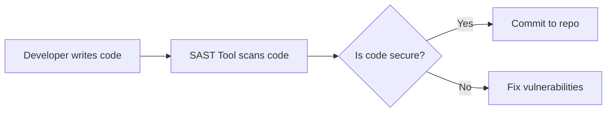

# **DevSecOps: Integrating Security into DevOps**  
*Notebook Based on the Lecture Transcript*  

---

## **Table of Contents**  
1. [Introduction to DevSecOps](#introduction)  
2. [The Three Pillars of DevSecOps](#pillars)  
3. [Shift-Left Security Approach](#shift-left)  
4. [Security in the Development Phase](#development-phase)  
5. [Security in the Operations Phase](#operations-phase)  
6. [Automated Compliance Scans](#compliance)  
7. [Example: PCI-DSS in DevSecOps](#pci-dss)  
8. [Conclusion](#conclusion)  

---

## **1. Introduction to DevSecOps** <a name="introduction"></a>  

### **Definition**  
**DevSecOps** (Development + Security + Operations) integrates **security practices** into the **DevOps pipeline**, ensuring security is a shared responsibility across teams.  

### **Why DevSecOps?**  
- Traditional **Software Development Lifecycle (SDLC)** often neglected security until late stages.  
- DevSecOps ensures **early vulnerability detection**, reducing risks in production.  

### **Core Principle**  
> *"Security is not a phase; it’s a continuous process embedded in every stage of development and operations."*  

---

## **2. The Three Pillars of DevSecOps** <a name="pillars"></a>  

| Pillar | Role in DevSecOps |  
|--------|------------------|  
| **Development** | Write secure code using **SAST, SCA, and secure coding checklists**. |  
| **Security** | Implement automated security testing (DAST, IAST) and compliance checks. |  
| **Operations** | Secure deployments, monitor runtime threats, and enforce infrastructure security (IaC). |  

**Visualization**:  
  

---

## **3. Shift-Left Security Approach** <a name="shift-left"></a>  

### **What is Shift-Left?**  
- Fix security issues **as early as possible** in the SDLC (e.g., during coding).  
- Avoids costly fixes in production.  

### **How It Works**  
1. **Developers** use SAST tools (e.g., SonarQube) while writing code.  
2. **CI/CD Pipelines** run automated security scans (SCA, DAST).  
3. **Pre-Production** checks block vulnerable builds.  

**Example**:  
🔹 *A SQL injection flaw is caught during code review (Shift-Left) instead of after a hacker exploits it (Shift-Right).*  

---

## **4. Security in the Development Phase** <a name="development-phase"></a>  

### **Key Practices**  
- **SAST Tools**: Scan source code for vulnerabilities (e.g., Fortify, Veracode).  
- **Secure Coding Checklists**: Define rules (e.g., OWASP Top 10) for developers.  
- **SCA Tools**: Check third-party libraries (e.g., Snyk, Dependency-Check).  

### **Workflow**  


---

## **5. Security in the Operations Phase** <a name="operations-phase"></a>  

### **Key Practices**  
- **Container Security**: Only allow scanned, vulnerability-free images in registries (e.g., Docker Hub, AWS ECR).  
- **Infrastructure as Code (IaC) Security**: Scan Terraform/CloudFormation files for misconfigurations.  

**Example**:  
🔹 *A Kubernetes cluster rejects a container with a critical CVE (e.g., Log4j) before deployment.*  

**Tools**:  
- **Clair** (Container scanning)  
- **Checkov** (IaC scanning)  

---

## **6. Automated Compliance Scans** <a name="compliance"></a>  

### **Why Compliance Matters**  
- Ensures adherence to standards like **PCI-DSS, HIPAA, GDPR**.  
- Automated tools enforce rules **continuously**.  

### **How It Works**  
1. Define compliance rules (e.g., "No public S3 buckets").  
2. Tools (e.g., **AWS Config, OpenSCAP**) scan infrastructure.  
3. Violations trigger alerts or block deployments.  

**Example**:  
```yaml
# Non-compliant CloudFormation (Public S3 Bucket)
Resources:
  MyBucket:
    Type: AWS::S3::Bucket
    Properties:
      AccessControl: PublicRead  # 🚨 Blocked by automated scan!
```  

---

## **7. Example: PCI-DSS in DevSecOps** <a name="pci-dss"></a>  

### **Scenario**  
A **credit card application** must comply with **PCI-DSS**:  
- **Requirement**: Encrypt stored cardholder data.  
- **DevSecOps Implementation**:  
  1. **SAST**: Checks for hardcoded encryption keys.  
  2. **DAST**: Tests payment APIs for leaks.  
  3. **Compliance Scans**: Validate infrastructure encryption settings.  

**Tools**:  
- **Hashicorp Vault** (Secrets management)  
- **Qualys** (PCI compliance scanning)  

---

## **8. Conclusion** <a name="conclusion"></a>  

### **Key Takeaways**  
1. **DevSecOps = DevOps + Security**.  
2. **Shift-Left** catches issues early.  
3. **Automation** is critical (SAST, SCA, DAST, IaC scans).  
4. **Compliance** must be continuous (PCI-DSS, HIPAA).  

### **Next Steps**  
- Explore **DevSecOps tools** (e.g., OWASP ZAP, Checkov).  
- Implement a **CI/CD pipeline with security gates**.  

**Quote to Remember**:  
> *"In DevSecOps, security is everyone’s job—not just the security team’s."*  

---

### **Visual Summary**  
  

📌 **Homework**:  
- Set up a **SAST scan** in a demo GitHub repo.  
- Try **Snyk** to scan a Python/Java project for vulnerable dependencies.  

See you in the next lecture! 🔒🚀
