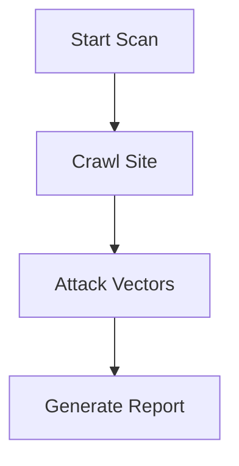
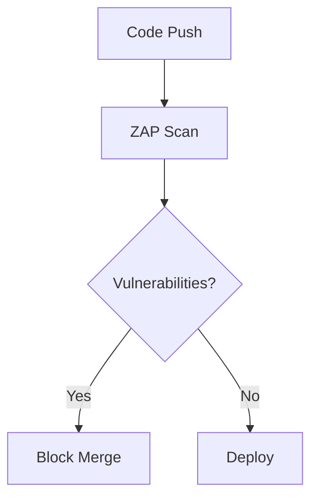

# **OWASP ZAP: Web Application Security Testing Guide**

## **Table of Contents**
1. [What is OWASP ZAP?](#what-is-zap)
2. [Key Features](#key-features)
3. [Installation Guide](#installation)
4. [Basic Scanning Workflow](#basic-workflow)
5. [Integrating ZAP with CI/CD](#ci-cd-integration)
6. [Advanced Scanning Techniques](#advanced-techniques)
7. [Interpreting Results](#interpreting-results)
8. [Best Practices](#best-practices)
9. [ZAP vs Other Tools](#comparison)
10. [Conclusion](#conclusion)

---

## **1. What is OWASP ZAP?** <a name="what-is-zap"></a>
**OWASP Zed Attack Proxy (ZAP)** is an open-source web application security scanner maintained by the Open Web Application Security Project (OWASP). It helps find vulnerabilities in web applications during development and testing.

**Why Use ZAP?**
✔ Free and open-source  
✔ Supports both **automated** and **manual** testing  
✔ Ideal for DevSecOps pipelines  
✔ Actively maintained with frequent updates  

---

## **2. Key Features** <a name="key-features"></a>

| Feature | Description |
|---------|-------------|
| **Automated Scanner** | Crawls and attacks web apps to find vulnerabilities |
| **Manual Testing Tools** | Proxy for manual security testing |
| **API Security Testing** | Supports REST and GraphQL APIs |
| **Authentication Support** | Handles login forms, CSRF tokens |
| **Plugins & Extensions** | Add-ons for enhanced functionality |

---

## **3. Installation Guide** <a name="installation"></a>

### **Windows/macOS/Linux**
1. Download from [OWASP ZAP Official Site](https://www.zaproxy.org/download/)
2. Run the installer (or use Docker for CI/CD):
   ```bash
   docker pull owasp/zap2docker-stable
   ```

### **Verify Installation**
```bash
zap.sh -version
```
*Should display the installed version.*

---

## **4. Basic Scanning Workflow** <a name="basic-workflow"></a>

### **Step 1: Quick Start**
1. Launch ZAP → Click **Automated Scan**  
2. Enter target URL (e.g., `http://example.com`)  
3. Click **Attack**  

### **Step 2: Review Results**
- Vulnerabilities appear in the **Alerts** tab.  
- Example findings:
  - `Cross-Site Scripting (XSS)`  
  - `SQL Injection`  
  - `Missing Security Headers`  

---

## **5. Integrating ZAP with CI/CD** <a name="ci-cd-integration"></a>

### **GitHub Actions Example**
```yaml
name: OWASP ZAP Scan

on: [push]

jobs:
  zap_scan:
    runs-on: ubuntu-latest
    steps:
      - name: Run ZAP Scan
        uses: zaproxy/action-baseline@v0.1.0
        with:
          target: 'http://your-website.com'
          rules_file_name: 'zap-rules.tsv'
```

### **Docker in CI**
```bash
docker run -t owasp/zap2docker-stable zap-baseline.py \
  -t http://example.com -r report.html
```

---

## **6. Advanced Scanning Techniques** <a name="advanced-techniques"></a>

### **1. Authenticated Scanning**
1. Configure **Contexts** → Define login steps.  
2. Use **Session Management** for cookies/tokens.  

### **2. API Scanning**
- Import OpenAPI/Swagger files.  
- Test REST endpoints for vulnerabilities.  

### **3. Custom Scripts**
- Write scripts in **ZAP Scripting Console** (JavaScript, Python).  

---

## **7. Interpreting Results** <a name="interpreting-results"></a>

| Risk Level | Action Required |
|------------|-----------------|
| **High**   | Fix immediately (e.g., SQLi) |
| **Medium** | Schedule fixes (e.g., XSS) |
| **Low**    | Monitor (e.g., Info leaks) |

**Sample Report**:
```
- High: SQL Injection in /login.php
- Medium: XSS in /contact-form
- Low: Missing X-Content-Type-Options header
```

---

## **8. Best Practices** <a name="best-practices"></a>

1. **Scan Early** – Integrate into development sprints.  
2. **Use Baseline Scans** – Quick tests for critical issues.  
3. **Combine with SAST** – Pair ZAP with SonarQube/Snyk.  
4. **Regular Updates** – Keep ZAP and add-ons updated.  

---

## **9. ZAP vs Other Tools** <a name="comparison"></a>

| Tool | Type | Cost | Best For |
|------|------|------|----------|
| **OWASP ZAP** | DAST | Free | DevSecOps, Automated Scans |
| **Burp Suite** | DAST | $$$ | Manual Pen Testing |
| **Nessus** | Network Scan | $$$ | Infrastructure Vulns |

---

## **10. Conclusion** <a name="conclusion"></a>
- **ZAP is essential** for finding web app vulnerabilities.  
- **Easy to integrate** with GitHub Actions/Jenkins.  
- **Start with baseline scans**, then explore advanced features.  



# **Integrating OWASP ZAP with GitHub Actions: Comprehensive Guide**

## **Table of Contents**
1. [Introduction to OWASP ZAP](#introduction)
2. [Why Integrate ZAP with GitHub Actions?](#why-integrate)
3. [Prerequisites](#prerequisites)
4. [Step-by-Step Integration](#integration-steps)
5. [Understanding the Workflow File](#workflow-explanation)
6. [Full Scan vs Baseline Scan](#scan-types)
7. [Interpreting Scan Results](#interpreting-results)
8. [Customizing Scans](#customizing-scans)
9. [Best Practices](#best-practices)
10. [Conclusion](#conclusion)

---

## **1. Introduction to OWASP ZAP** <a name="introduction"></a>
**OWASP Zed Attack Proxy (ZAP)** is an open-source DAST (Dynamic Application Security Testing) tool that helps identify vulnerabilities in web applications.

**Key Features**:
- Automated and manual testing
- REST API scanning
- Authentication support
- Active and passive scanning modes

---

## **2. Why Integrate ZAP with GitHub Actions?** <a name="why-integrate"></a>
✅ **Automated Security Testing** - Catch vulnerabilities in CI/CD pipelines  
✅ **Shift-Left Security** - Detect issues before production  
✅ **Open Source** - No licensing costs  
✅ **Customizable** - Supports both quick scans and in-depth testing  

---

## **3. Prerequisites** <a name="prerequisites"></a>
1. **GitHub Account** (for repository and Actions)
2. **Vulnerable Web App** (e.g., [OWASP Juice Shop](https://owasp.org/www-project-juice-shop/))
3. **Basic YAML Knowledge** (for workflow files)

---

## **4. Step-by-Step Integration** <a name="integration-steps"></a>

### **Step 1: Find ZAP GitHub Action**
1. Go to GitHub Marketplace → Search "OWASP ZAP"
2. Select **[OWASP ZAP Full Scan](https://github.com/marketplace/actions/owasp-zap-full-scan)** or Baseline Scan

### **Step 2: Create Workflow File**
1. In your repo, create `.github/workflows/zap-scan.yml`
2. Paste this YAML:

```yaml
name: OWASP ZAP Scan

on: [push]

jobs:
  zap_scan:
    runs-on: ubuntu-latest
    steps:
      - name: Checkout
        uses: actions/checkout@v3
        
      - name: ZAP Scan
        uses: zaproxy/action-full-scan@v0.2.0
        with:
          target: 'https://example.com'  # Replace with your target URL
          rules_file_name: 'zap-rules.tsv'  # Optional custom rules
```

### **Step 3: Run the Scan**
1. Commit the file → GitHub Actions will trigger ZAP automatically
2. View results in the **Actions** tab

---

## **5. Understanding the Workflow File** <a name="workflow-explanation"></a>

| Key Section | Purpose | Example |
|-------------|---------|---------|
| **`on`** | Trigger events | `push`, `pull_request` |
| **`jobs`** | Defines scan job | `zap_scan` |
| **`runs-on`** | GitHub-hosted runner | `ubuntu-latest` |
| **`target`** | URL to scan | `https://vulnerable-site.com` |
| **`rules_file_name`** | Custom scan rules | `owasp-rules.tsv` |

---

## **6. Full Scan vs Baseline Scan** <a name="scan-types"></a>

| Feature | Full Scan | Baseline Scan |
|---------|----------|--------------|
| **Depth** | Comprehensive (slow) | Quick check (fast) |
| **Use Case** | Pre-production | CI/CD pipelines |
| **Time** | 10-30 mins | 1-5 mins |
| **Action** | `zaproxy/action-full-scan` | `zaproxy/action-baseline` |

**Recommendation**: Use **Baseline Scan** for CI/CD due to speed.

---

## **7. Interpreting Scan Results** <a name="interpreting-results"></a>

### **Sample Output**
```
- High: SQL Injection in /login.php
- Medium: XSS in /contact-form
- Low: Missing security headers
```

### **Risk Levels**
| Level | Action |
|-------|--------|
| **High** | Fix immediately |
| **Medium** | Schedule fixes |
| **Low** | Monitor |

---

## **8. Customizing Scans** <a name="customizing-scans"></a>

### **A. Authenticated Scanning**
```yaml
with:
  target: 'https://example.com'
  login_url: 'https://example.com/login'
  username: 'admin'
  password: '${{ secrets.ADMIN_PWD }}'
```

### **B. API Scanning**
1. Add OpenAPI/Swagger file
2. Use `-t api-spec.json` in command options

### **C. Passive Scanning Only**
```yaml
command_options: '-cmd -silent'
```

---

## **9. Best Practices** <a name="best-practices"></a>
1. **Scan Staging Environments** - Avoid production systems  
2. **Schedule Weekly Scans** - Complement CI/CD scans  
3. **Combine with SAST** - Use Snyk/SonarQube for code analysis  
4. **Review False Positives** - Tune rules over time  

---

## **10. Conclusion** <a name="conclusion"></a>
- **OWASP ZAP + GitHub Actions** = Automated web app security  
- **Baseline scans** for fast CI/CD feedback  
- **Full scans** for deep pre-release testing  




