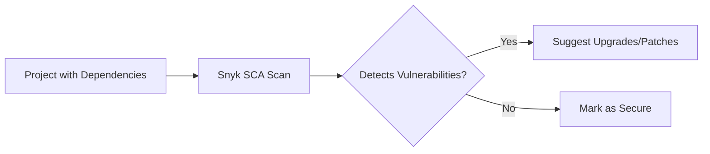

# **Snyk: Comprehensive Security Platform Guide**  


---

## **Table of Contents**  
1. [Introduction to Snyk](#introduction)  
2. [Snyk's Core Security Capabilities](#capabilities)  
3. [Software Composition Analysis (SCA) with Snyk](#sca)  
4. [Container Security](#container-security)  
5. [Infrastructure as Code (IaC) Security](#iac)  
6. [Integration with Development Workflows](#integration)  
7. [Key Benefits of Snyk](#benefits)  
8. [Conclusion](#conclusion)  

---

## **1. Introduction to Snyk** <a name="introduction"></a>  
**Snyk** is a **developer-first security platform** (SaaS) that helps organizations:  
- Identify and fix vulnerabilities in **source code, dependencies, containers, and IaC**.  
- Shift security **left** by integrating into CI/CD pipelines and developer tools.  

**Key Features**:  
- **SAST** (Static Application Security Testing)  
- **SCA** (Software Composition Analysis)  
- **Container Vulnerability Scanning**  
- **IaC Misconfiguration Detection**  

---

## **2. Snyk's Core Security Capabilities** <a name="capabilities"></a>  

### **A. Static Application Security Testing (SAST)**  
- Scans **source code** for security flaws (e.g., SQL injection, hardcoded secrets).  
- **Example**:  
  ```python
  # 🚨 Snyk SAST flags this hardcoded AWS key:
  AWS_ACCESS_KEY
  ```
- **Supported Languages**: Java, Python, JavaScript, Go, etc.  

### **B. Software Composition Analysis (SCA)**  
- Scans **open-source dependencies** for known vulnerabilities.  
- **Example**: Detects **Log4j (CVE-2021-44228)** in project dependencies.  
- **Databases Used**:  
  - Snyk Vulnerability DB  
  - National Vulnerability Database (NVD)  

---

## **3. Software Composition Analysis (SCA) with Snyk** <a name="sca"></a>  

### **How Snyk SCA Works**  
1. **Dependency Graph Analysis**: Maps all third-party libraries in a project.  
2. **Vulnerability Matching**: Checks against Snyk’s vulnerability database.  
3. **Remediation Guidance**: Suggests fixes (e.g., upgrade to a patched version).  

**Example Workflow**:  


**Supported Package Managers**:  
- npm, Maven, pip, Gradle, NuGet  

---

## **4. Container Security** <a name="container-security"></a>  

### **What Snyk Scans in Containers**  
- **Base Image Vulnerabilities** (e.g., outdated Alpine Linux).  
- **Application Dependencies** inside containers.  
- **Misconfigurations** (e.g., running as root).  

**Example**:  
```dockerfile
# 🚨 Snyk flags this insecure Dockerfile:
FROM node:14  # Outdated version with CVEs
```

**Integration with**:  
- Docker Hub  
- AWS ECR  
- Kubernetes  

---

## **5. Infrastructure as Code (IaC) Security** <a name="iac"></a>  

### **Supported IaC Formats**  
| Tool | Snyk Coverage |  
|------|--------------|  
| **Terraform** | AWS/Azure/GCP misconfigurations |  
| **CloudFormation** | AWS resource security checks |  
| **Kubernetes** | YAML manifest validation |  

**Example Terraform Issue**:  
```terraform
# 🚨 Snyk flags this public S3 bucket:
resource "aws_s3_bucket" "logs" {
  acl = "public-read"  # Should be private!
}
```

---

## **6. Integration with Development Workflows** <a name="integration"></a>  

### **A. IDE Plugins**  
- **VS Code, IntelliJ, Eclipse**: Real-time vulnerability detection.  
- **Example**:  
    

### **B. CI/CD Pipelines**  
- **GitHub Actions**:  
  ```yaml
  - name: Run Snyk Scan
    uses: snyk/actions/node@master
    env:
      SNYK_TOKEN: ${{ secrets.SNYK_TOKEN }}
  ```
- **Jenkins, CircleCI**: Native integrations.  

### **C. SCM Integration**  
- **GitHub, GitLab, Bitbucket**: Automatic PR checks.  

---

## **7. Key Benefits of Snyk** <a name="benefits"></a>  

1. **Developer-Friendly**:  
   - Fix guidance with **one-click PRs**.  
   - CLI for local testing.  

2. **Comprehensive Coverage**:  
   - Code → Dependencies → Containers → Cloud.  

3. **Shift-Left Security**:  
   - Catches issues **early** in SDLC.  

4. **Prioritization**:  
   - Risk scores for vulnerabilities.  

---

## **8. Conclusion** <a name="conclusion"></a>  

### **Summary**  
- **SAST**: Secure custom code.  
- **SCA**: Secure open-source dependencies.  
- **Container/IaC**: Secure deployments.  

